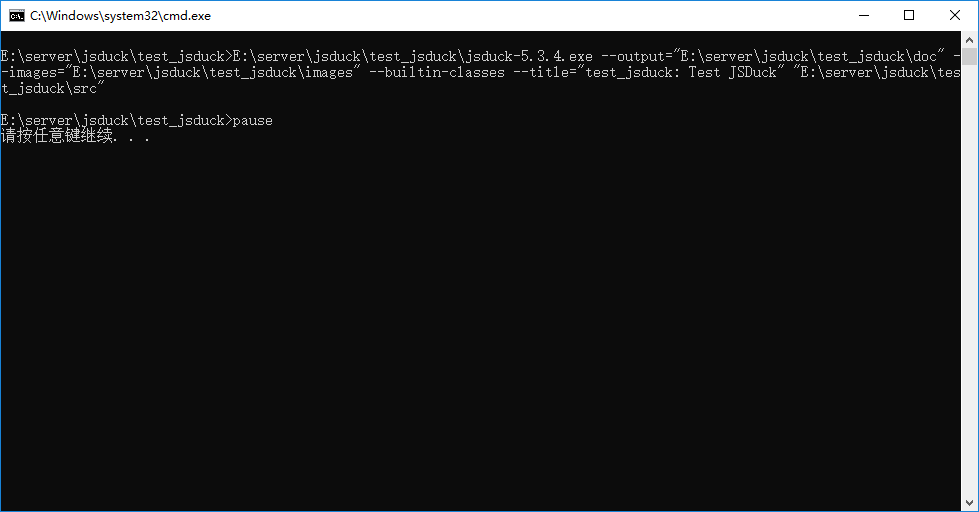
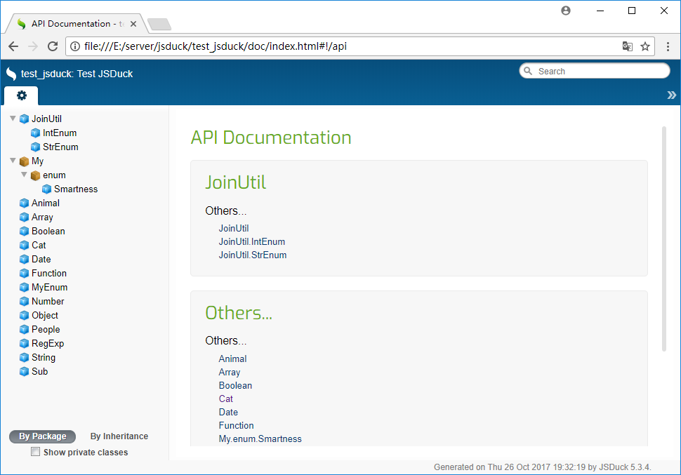
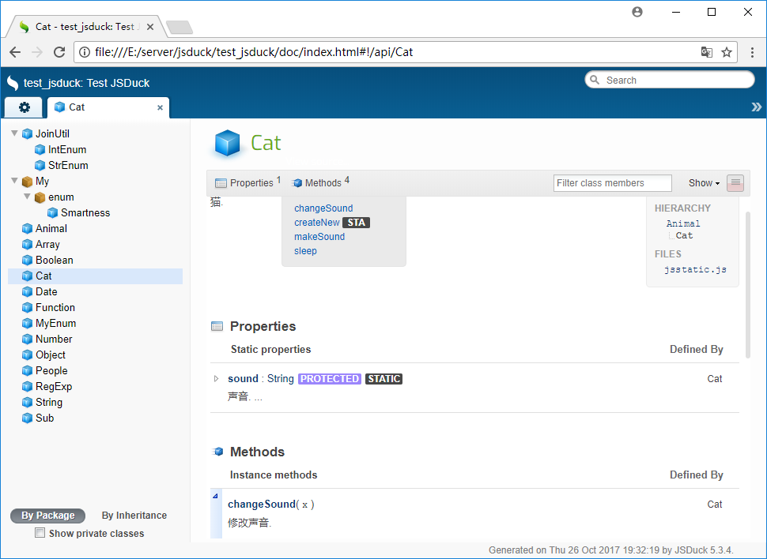

# test_jsduck

Test JSDuck make JavaScript code document(测试JSDuck生成JavaScript代码的文档)

Links:

* Git:	https://github.com/zyl910/test_jsduck
* Blog:	http://www.cnblogs.com/zyl910/tag/test_jsduck/

## Guide (指南)

Run `jsduck_make.bat`



Doccument:





Sample code:

```JavaScript
/** 动物.
 */
var Animal = {
	/** 创建 动物.
	 *
	 * @return  {Animal}	返回所创建的对象.
	 * @static
	 */
	createNew: function(){
		var animal = {};
		/** 睡觉.
		 */
		animal.sleep = function(){ alert("睡懒觉"); };
		return animal;
	}
};

/** 猫.
 *
 * @extends Animal
 */
var Cat = {
	/** 声音.
	 * @static @protected
	 */
	sound : "喵喵喵",
	/** 创建 猫.
	 *
	 * @return  {Cat}	返回所创建的对象.
	 * @static
	 */
	createNew: function(){
		var cat = Animal.createNew();
		/** 发声.
		 */
		cat.makeSound = function(){ alert(Cat.sound); };
		/** 修改声音.
		 * @param {String}	x	声音.
		 */
		cat.changeSound = function(x){ Cat.sound = x; };
		return cat;
	}
};

```


## Change history (变更日志)

[2017-12-21] v1.2:

* Encapsulation Inheritance and Polymorphism (封装、继承与多态) .

[2017-11-09] v1.1: http://www.cnblogs.com/zyl910/p/js_namespace_bestpractice.html

* Define namespace (定义命名空间) .

[2017-10-26] v1.0: http://www.cnblogs.com/zyl910/p/test_jsduck_on_windows.html

* Release v1.0 (发布1.0版).
